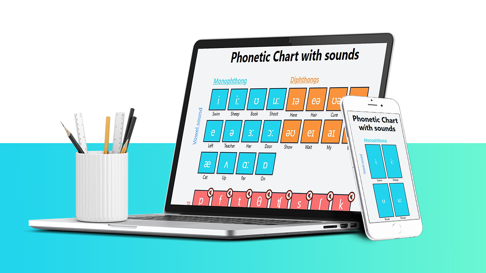

# Phonetic Sounds App
This is a web application that helps users learn and practice English phonetic sounds. It includes a set of monophthongs and diphthongs, which are organized in an array of objects that contain properties such as the letter, the sound file, the sound type, and an example word.

The app defines an array of objects that contain information about the phonetics sounds. Each object has properties such as the letter, the sound file, and an example word. When the user clicks on a sound card, the app plays the corresponding sound using the SpeechSynthesis API. When the user clicks on the example word, the app speaks the word out loud using the same API.

## Requirements
To run this app, you need to have a web browser that supports the SpeechSynthesis API. This API is available in most modern browsers, including Google Chrome, Mozilla Firefox, and Microsoft Edge.
 
## Made With 🌞 
  
  
  
 
 

